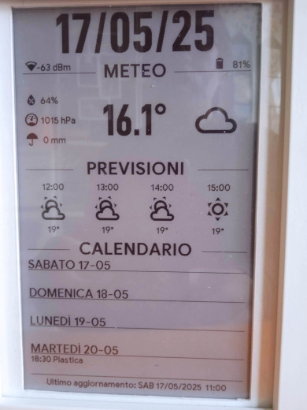

# 7.5-epaper-esphome
- Codice per un epaper b/n da 7.5 sotto esphome.
- Visualizzazione dati su display e-paper con ESPHome.
- Progetto per ESP32 e display e-ink 7.5, con gestione avanzata del deep sleep e aggiornamento display solo in determinate fasce orarie.

## Caratteristiche
- Aggiornamento dati da Home Assistant via API o MQTT
- Deep sleep notturno per evitare consumi inutili (es. 22.30-08.30, gestibile tramite HA)
- Clean completo del display al primo risveglio mattutino ed ad ogni risveglio per l'aggiornamento.
- Ciclo di aggiornamento del display personalizzabile (10-60 minuti, gestibile tramite HA)
- Durata Esp32 attivo personalizzabile (10-180 secondi, gestibile tramite HA)
- Scelta numero previsioni meteo giornaliere (1-4 giorni, gestibile tramite HA)
- Scelta numero previsioni meteo orarie (1-4 ore, gestibile tramite HA)

## Hardware utilizzato
- Waveshare ESP32 epaper Driver Board Rev.3
- Display e-paper Waveshare 7.5 B/N
- Modulo di alimentazione senza interruzioni UPS 5V 2A 15w
- Batteria Li-Po ricaricabile da 3,7 V 3000 mAh 104050
- Cornice Ikea - RÖDALM 13x18
- Presa usb da pannello 2 fili
- 2 resistenze da 200Khom (per la gestione del pin adc)
- 1 diodo schottky 1N5817 (per la protezione dell'esp32 - opzionale)

## File forniti
- epaper-esphome.yaml : configurazione principale ESPHome
- sensor.yaml: sensori utilizzati per i dati del display
- script sotto Home Assistant: per le gestione degli input text
- automazione sotto Home Assitant: per avviare lo script ad ogni mezzanotte 
- input_text input_date sotto Home assistant: per la gestione degli eventi del calendario
- input_datetime sotto Home Assistant: per la gestione dei tempi Deep Sleep

## Come usare questo progetto
1. Carica il file YAML su ESPHome.
2. Personalizza le impostazioni (pinnatura, WiFi, sensori, nomi delle entità).
3. Compila e flasha il firmware su ESP32.
4. Aggiungi l'integrazione su Home Assistant, se desiderato.
5. Copia/incolla e configura a piacere automazioni/script/input per invio dati, aggiornamento, deep sleep.

## Deep sleep intelligente
Il dispositivo:
- Va in deep sleep profondo di notte (fascia configurabile)
- Si risveglia al mattino e fa un clean del display
- Durante il giorno si aggiorna ogni 20 minuti (configurabile)

## Immagini
Ecco alcune immagini del progetto:

## Licenza
MIT (vedi file LICENSE)

## Credits
Creato da echopage1964  
Ispirato dalla community ESPHome & Home Assitant. Un sentito grazie a Madelena, Sloma, Debruina e tutti gli altri utenti della community per il contributo, il codice originale e i vari fork da cui sono partito!  
Se mi fossi dimenticato di qualcuno, mi scuso per la dimenticanza non voluta!

